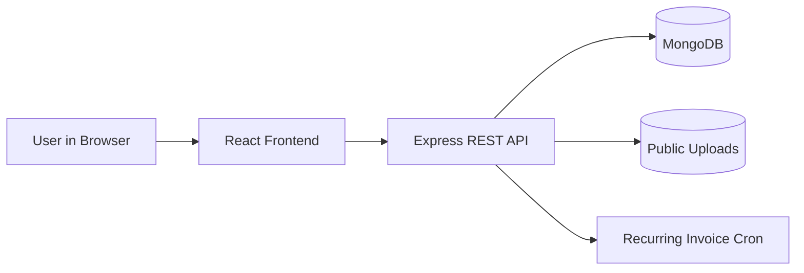

# CRM of Kleardocs - Architecture Overview

This document is a quick map of the project for freshers and junior developers.

## Documentation Index

- Frontend working flow: `FRONTEND_WORKING_FLOW.md`
- Backend working flow: `BACKEND_WORKING_FLOW.md`
- Frontend to backend integration flow: `FRONTEND_TO_BACKEND_WORKING_FLOW.md`

## High-Level Architecture



## Main Tech Stack

- Frontend: React, Redux Toolkit, React Router, Axios, Tailwind-style utility classes
- Backend: Node.js, Express, Mongoose, Zod validation, JWT-based auth, cron jobs
- Data: MongoDB collections (customers, services, invoices, templates, compliances, logs)

## Project Structure (Conceptual)

```text
Frontend/
  src/
    pages/                 # Route-level screens
    components/            # Reusable UI pieces and modals
    redux/slices/          # State + async API calls
    api/                   # Axios instance and API helpers

Backend/
  src/
    routes/                # API endpoints
    controllers/           # Request/response handlers
    services/              # Business logic
    models/                # Mongoose schemas
    middleware/            # Auth, validation, error/security
    cron/                  # Scheduled jobs
```

## Typical Data Path

1. User action on frontend (button click / form submit).
2. Redux thunk dispatches API call through Axios.
3. Backend route -> controller -> service.
4. Service reads/writes MongoDB.
5. API response returns transformed payload.
6. Redux updates UI state, page re-renders.

