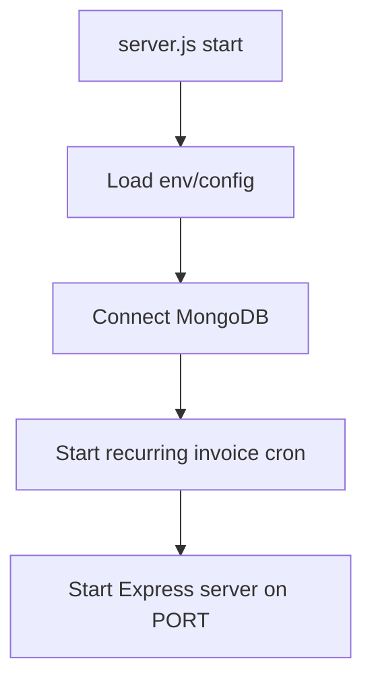
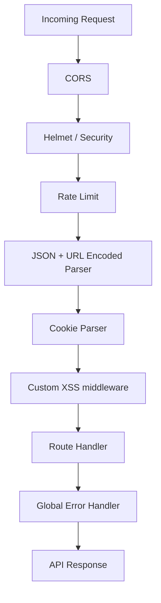
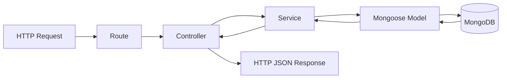
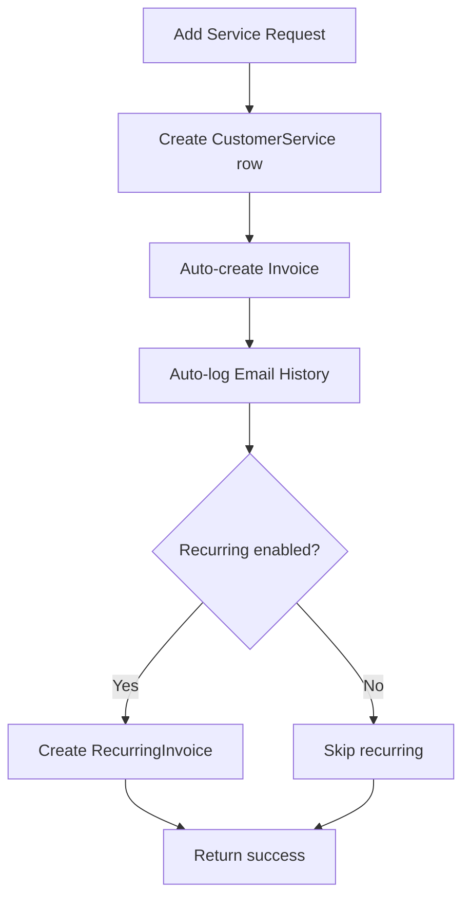

# Backend Working Flow

This file explains backend request flow and module responsibilities.

## 1) Backend Startup Flow

Files:
- `Backend/server.js`
- `Backend/src/app.js`

## 2) Express App Pipeline

File:
- `Backend/src/app.js`

## 3) Layered Architecture

- **Routes**: endpoint mapping + middleware wiring
- **Controllers**: parse request, call service, format response
- **Services**: business logic, orchestration, transformations
- **Models**: schemas and DB operations

## 4) Key API Modules

From `app.js`:
- `/api/v1/auth`
- `/api/v1/leads`
- `/api/v1/customers`
- `/api/v1/services`
- `/api/v1/compliance-settings`
- `/api/v1/financial-years`
- `/api/v1/invoices`
- `/api/v1/recurringinvoices`
- `/api/v1/templates`
- `/api/v1/users`
- `/api/v1/jobs`

## 5) Example: Customer Details API Flow

Endpoint:
- `GET /api/v1/customers/:customerId?year=YYYY-YYYY`

Service behavior (high-level):
1. Validate customer exists.
2. Fetch related directors/services/invoices/email history.
3. Use year filter for compliances.
4. For attached year, backfill missing compliance rows from settings.
5. Return normalized response used directly by frontend sections.

## 6) Example: Add Service Business Flow

Service function:
- `addService(customerId, data, userId)`

## 7) Backend Debug Checklist

1. Confirm route path and HTTP method.
2. Check auth/role middleware.
3. Validate payload against Zod schemas.
4. Add logs inside service for missing/legacy data.
5. Verify DB records in Mongo for exact field names.
6. Check global error response for clear message.

