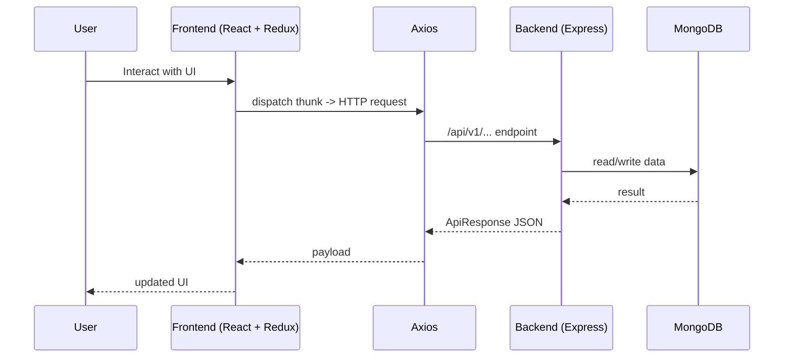
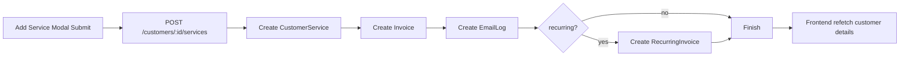

# Frontend to Backend Working Flow

This file explains how data moves between frontend and backend in real usage.

## 1) End-to-End Integration Flow

## 2) Integration Responsibilities

- **Frontend**
  - Captures user input
  - Triggers async thunks
  - Stores API results in Redux
  - Renders sections/modals

- **Backend**
  - Authenticates request
  - Validates request body/query
  - Applies business rules
  - Reads/writes MongoDB
  - Returns normalized response

## 3) Real Feature Example: Customer Service Add Flow

User path:
- Customer Details -> Add Service modal -> Submit

Backend effects:
- Service history row created
- Invoice history row created
- Email template history row created
- Recurring invoice row created if toggle enabled

## 4) Real Feature Example: Annual Compliance Year Load

User path:
- Add financial year -> Select year -> Load

Backend effects:
- Year attached to customer
- On load, missing compliances backfilled from Compliance Settings
- Filtered compliance list returned for that year

## 5) Data Contract Guidelines (Important for Juniors)

1. Keep response shape stable (do not rename fields casually).
2. Normalize IDs (`id` vs `_id`) carefully.
3. Handle legacy rows with fallback logic when possible.
4. Ensure frontend supports null/empty values.
5. Use strict matching for names where business mapping is required.

## 6) Common Integration Failure Points

- Wrong endpoint or method (`PUT` vs `DELETE`)
- Missing auth token (`401 /auth/me`)
- Mismatch in response shape (object rendered as string)
- Missing DB master data (template names not found)
- Legacy data without references (`templateName` exists but `template` is null)

## 7) Recommended Developer Workflow

1. Start frontend + backend.
2. Reproduce in UI.
3. Inspect Network request/response.
4. Trace slice thunk -> backend route -> service.
5. Verify Mongo records.
6. Patch minimal layer where root cause exists.
7. Re-test end-to-end.

