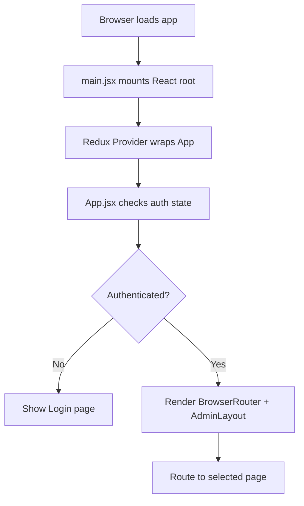
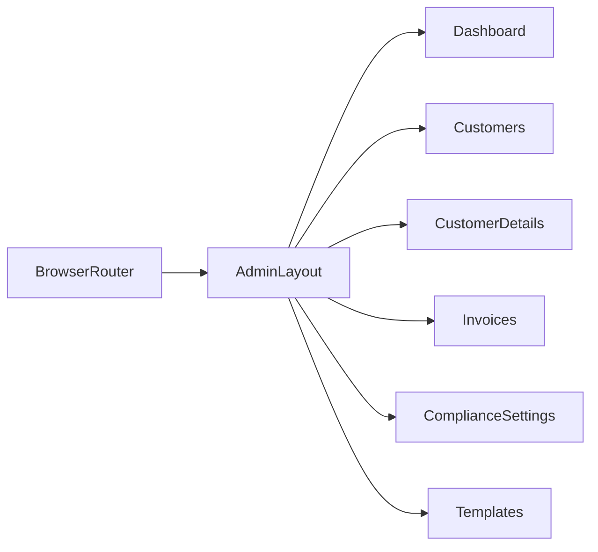
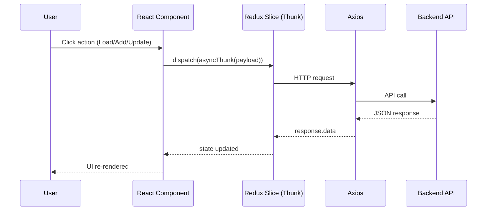

# Frontend Working Flow

This file explains how frontend works end-to-end for junior developers.

## 1) Frontend Boot Flow

Files:
- `Frontend/src/main.jsx`
- `Frontend/src/App.jsx`

## 2) Routing Flow

Main route file:
- `Frontend/src/App.jsx`

Important routes include:
- `/dashboard`
- `/leads`
- `/customers`
- `/customer/:id`
- `/invoices`
- `/invoice/:id`
- `/compliance-settings`
- `/templates`

## 3) Redux + API Data Flow

Pattern used across features:

## 4) Example: Customer Details Page Flow

File:
- `Frontend/src/pages/CustomerDetailsPage.jsx`

On load:
1. Reads `customerId` from route params.
2. Dispatches `fetchCustomerById`.
3. Renders sections:
   - Annual Compliance
   - Services
   - Invoices
   - Recurring Invoices
   - Email Template History

On actions:
- Add financial year -> updates customer FY list
- Load year -> fetches compliances for that year
- End service -> confirm modal -> API call -> refresh data
- View email history -> opens email details modal with preview data

## 5) UI Pattern Used in this Project

- Page-level container holds data and handlers
- Reusable components render tables/cards
- Modals handle create/edit/confirm flows
- Toasts (`react-hot-toast`) show success/error feedback
- Loading states shown with `ContentLoader` or `Loader`

## 6) Frontend Debug Checklist

If something does not show on UI:
1. Check Redux state in DevTools.
2. Check Network tab response payload.
3. Verify component receives expected props.
4. Confirm field names match response (`body` vs `content`, etc.).
5. Validate auth token/session (`/auth/me` errors can block fetches).

